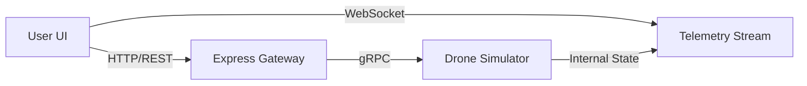

# 🚁 Wind Farm Drone Inspection GCS (Ground Control System)


## 📖 Project Overview

This project is a **web-based Ground Control System (GCS)** designed to simulate and control autonomous inspection drones in large-scale wind farms. It provides a realistic 3D visualization of the drone's flight, real-time telemetry monitoring, and command capabilities.

The system is built to mimic real-world industrial drone operations, featuring **environmental simulation** (wind gusts, battery drain), **mission planning**, and **emergency failsafes**.

---

## 🛠️ Technology Stack

### Frontend (Client)
*   **React 18 & TypeScript**: Component-based UI with type safety.
*   **CesiumJS (Resium)**: High-fidelity 3D geospatial visualization for rendering the wind farm terrain, turbine models, and drone flight path.
*   **Mantine UI**: Modern, responsive component library for the dashboard layout.
*   **Framer Motion**: Smooth animations for UI transitions and responsive widget resizing.
*   **Tabler Icons**: Clean, professional iconography.

### Backend (Server & Simulator)
*   **Node.js**: Runtime environment.
*   **gRPC (Google Remote Procedure Call)**: Used for robust, typed communication between the API Gateway and the Drone Simulator.
*   **Protobuf (Protocol Buffers)**: Defines the strict schema for drone commands and telemetry, ensuring data integrity.
*   **WebSocket (ws)**: Streams real-time telemetry data (10Hz) to the frontend with low latency.
*   **Express.js**: Acts as a REST API Gateway, bridging the frontend HTTP requests to the internal gRPC services.

---

## 🏗️ System Architecture

The architecture is designed to be **modular** and **scalable**, simulating a microservices environment often found in enterprise robotics systems.



> **Note**: If the diagram above is not rendering, you can view the [Interactive Flowchart](./flowchart.html) in your browser.

1.  **Command Flow**: User clicks "TAKEOFF" -> React sends HTTP POST -> Express Gateway translates to gRPC -> Simulator executes physics logic.
2.  **Telemetry Flow**: Simulator updates physics (100ms loop) -> Pushes state to WebSocket Server -> React Frontend receives and renders updates.

---

## 💡 Key Features & Design Philosophy

### 1. Realistic 3D Visualization (Why Cesium?)
Instead of a simple 2D map, I chose **CesiumJS** to render the **Alta Wind Energy Center** in California. This allows operators to visualize the drone's altitude and orientation relative to the massive wind turbines, which is critical for inspection missions.
*   *Implementation*: Custom `Entity` management for rotating turbine blades and drone orientation using `Quaternion` math.

### 2. Robust Communication (Why gRPC?)
While REST is common, I implemented **gRPC** for the internal control logic.
*   **Reasoning**: In real robotics, commands must be precise. gRPC with Protobuf enforces a strict contract (schema), reducing runtime errors and allowing the backend simulation to be easily rewritten in high-performance languages like C++ or Go in the future without breaking the frontend.

### 3. Physics-Based Simulation
The drone isn't just an animation; it's a state machine with physics.
*   **Wind Simulation**: Random wind gusts affect the drone's position (jitter) and battery consumption.
*   **Battery Logic**: Climbing and high-speed intercepts drain the battery faster than hovering.
*   **Failsafes**: If the battery is critical or connection is lost, the drone automatically triggers "Return to Home" (RTH).

### 4. Responsive & Fluid UI
The dashboard is designed for usability.
*   **Free Resizing**: Widgets (Control, Telemetry, Video) can be resized freely. The content inside adapts (hides logs, shrinks fonts) using `ResizeObserver`.
*   **Smooth Transitions**: `Framer Motion` ensures that layout changes feel organic, not jarring.

---

## 🚀 Getting Started

### Prerequisites
*   Node.js (v16+)
*   npm or yarn

### Installation & Run
The project includes a startup script to launch both frontend and backend.

```bash
# 1. Clone the repository
git clone [repo-url]

# 2. Install dependencies (Root, Frontend, Backend)
npm install
cd frontend && npm install
cd ../backend && npm install

# 3. Start the system
./start.sh
```

*   **Frontend**: http://localhost:5173
*   **Backend API**: http://localhost:3001
*   **WebSocket**: ws://localhost:8080

---

## 🔮 Future Improvements
*   **Mission Planner**: Drag-and-drop waypoint creation on the 3D map.
*   **Video Streaming**: Replace the simulated video feed with WebRTC for real camera input.
*   **gRPC-Web**: Connect the frontend directly to gRPC, removing the Express Gateway for even lower latency.
